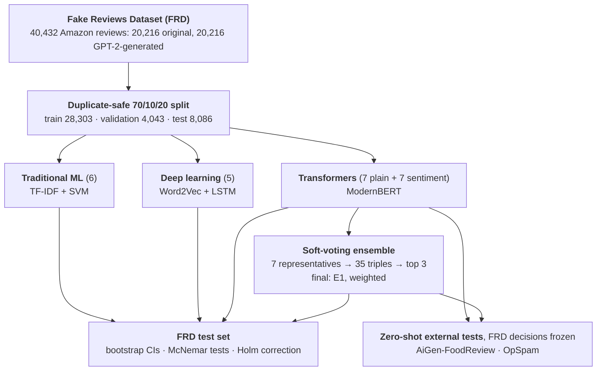

# Fake Review Detection across Classical, Deep, and Transformer Models

This repository contains the code, data, predictions, and statistical outputs
for a leakage-controlled comparison of classical machine-learning,
deep-learning, and Transformer detectors for machine-generated reviews, with a
zero-shot evaluation on reviews from a newer generator and domain.

## Overview

Reported fake-review detection results are hard to compare because studies
differ in data partitions, duplicate handling, threshold selection, and use of
the test set during development. This study evaluates 25 classifiers on the
Fake Reviews Dataset (FRD; human-written Amazon reviews versus GPT-2-generated
reviews) under one protocol:

- one duplicate-safe 70/10/20 partition shared by all systems
- every development decision (checkpoints, thresholds, models, ensembles) made on validation data only
- a test set used only for final evaluation and paired inference
- a zero-shot test on AiGen-FoodReview (human-written Yelp reviews versus GPT-4-Turbo-generated reviews) with all FRD decisions frozen

The 25 classifiers are 6 traditional machine-learning models, 5 deep-learning
models, 7 pretrained Transformer encoders, and a sentiment-augmented variant of
each encoder. A soft-voting ensemble is then selected from the Transformer
configurations by searching all 35 three-member combinations on validation
data.

## Study Design



Each model family is represented by its validation-selected system (shown in
the boxes). The ensemble combines Transformer configurations only.

## Research Questions

1. How does performance change from traditional to deep-learning to pretrained Transformer representations under a common partition?
2. Are the gains between stages statistically supported on the same test observations?
3. Does sentiment augmentation help consistently across Transformer backbones?
4. Do the FRD-trained systems retain useful discrimination zero-shot on AiGen-FoodReview?

## Main Findings

### Stage progression on the FRD test set

| Stage | Validation-selected system | Test accuracy, % [95% CI] | FP / FN | Δ vs. row above, pp [95% CI] | *p*<sub>Holm</sub> |
|---|---|---|---|---|---|
| Traditional ML | TF-IDF + SVM | 94.32 [93.80, 94.83] | 288 / 171 | – | – |
| Deep learning | Word2Vec + LSTM | 95.00 [94.56, 95.45] | 198 / 206 | +0.68 [+0.16, +1.24] | 0.030 |
| Plain Transformer | ModernBERT | 98.23 [97.98, 98.52] | 98 / 45 | +3.23 [+2.78, +3.71] | 7.3 × 10<sup>−36</sup> |
| Best individual configuration | ModernBERT + Sentiment | 98.32 [98.06, 98.60] | 60 / 76 | +0.09 [−0.16, +0.35] | 0.594 |
| Final ensemble | E1: DistilBERT + S, ModernBERT + S, RoBERTa + S (weights 0.10 / 0.45 / 0.45) | 98.75 [98.52, 99.00] | 41 / 60 | +0.43 [+0.21, +0.67] | 3.9 × 10<sup>−4</sup> |

8,086 test reviews (4,044 human-written, 4,042 GPT-2-generated). FP:
human-written reviews labeled machine-generated; FN: the reverse. Each row is
compared with the row above on the same reviews (McNemar test, one Holm family
of four comparisons). The final ensemble reaches a ROC-AUC of 0.9991.

### Sentiment augmentation, backbone-matched

| Backbone | Plain, % | + Sentiment, % | Δ, pp [95% CI] | *p*<sub>Holm</sub> |
|---|---|---|---|---|
| BERT | 97.13 | 96.55 | −0.58 [−0.89, −0.28] | 0.0029 |
| RoBERTa | 96.85 | 98.02 | +1.17 [+0.77, +1.56] | 1.8 × 10<sup>−8</sup> |
| DeBERTa | 98.06 | 98.10 | +0.04 [−0.23, +0.33] | 1.000 |
| DeBERTa-v3 | 98.23 | 98.02 | −0.21 [−0.46, +0.04] | 0.556 |
| ModernBERT | 98.23 | 98.32 | +0.09 [−0.16, +0.35] | 1.000 |
| ELECTRA | 98.10 | 97.07 | −1.03 [−1.37, −0.72] | 1.2 × 10<sup>−8</sup> |
| DistilBERT | 98.23 | 98.12 | −0.11 [−0.38, +0.16] | 1.000 |

The sentiment-augmented variant adds a nine-dimensional TextBlob sentiment
profile through a fusion head (gated for DeBERTa-v3), so each difference is
the joint effect of the profile and the head. Holm correction within these
seven comparisons.

### Zero-shot transfer to AiGen-FoodReview

| System | FRD test accuracy, % | AiGen accuracy, % | Generated reviews detected | AiGen ROC-AUC [95% CI] |
|---|---|---|---|---|
| Plain BERT | 97.13 | 49.06 | 0 of 2,044 | 0.9055 [0.894, 0.916] |
| ModernBERT | 98.23 | 49.26 | 0 of 2,044 | 0.7238 [0.708, 0.740] |
| ModernBERT + Sentiment | 98.32 | 49.21 | 0 of 2,044 | 0.4522 [0.435, 0.470] |
| Final ensemble (E1) | 98.75 | 49.18 | 0 of 2,044 | 0.4357 [0.418, 0.454] |
| All-authentic rule | – | 49.28 | 0 of 2,044 | 0.5000 |

4,030 reviews (1,986 authentic, 2,044 generated by GPT-4-Turbo); thresholds,
sentiment scalers, and ensemble weights are frozen from FRD. All 14
configurations and 6 ensembles are in
[`results/external_aigen/all_systems_primary_metrics_with_ci.csv`](results/external_aigen/all_systems_primary_metrics_with_ci.csv).

### Summary

- **Pretrained representations bring the largest gain.** The step from deep learning to the plain Transformer adds 3.23 points and cuts test errors from 404 to 143; the step from traditional to deep learning adds 0.68 points.
- **The ensemble adds a small but significant improvement.** It corrects 57 of the 79 reviews on which it disagrees with the best individual configuration. Weighting is not the source of the gain: equal voting over the same three members reaches 98.70%.
- **Sentiment augmentation is architecture-dependent.** It improves RoBERTa, degrades BERT and ELECTRA, and shows no significant accuracy difference for the other four backbones.
- **The in-domain results do not transfer.** On AiGen-FoodReview every system labels nearly all generated reviews as authentic (recall ≤ 0.0015). Plain BERT still ranks the classes correctly (ROC-AUC 0.9055; 0.850 on generated reviews without title lines or line breaks), whereas the final ensemble ranks them in reverse. Across the 14 configurations, FRD accuracy is only weakly associated with AiGen ROC-AUC (Spearman ρ = 0.12).
- **OpSpam gives the same picture** (accuracy 50.1–52.3%), but its deceptive reviews are written by people, so it is reported for transparency rather than as an external benchmark.

## Quick Look

No installation is needed to inspect the results:

- all 25 classifiers and the ensembles, with validation and test metrics and full confusion counts: [`results/frd_benchmark/all_systems.csv`](results/frd_benchmark/all_systems.csv)
- paired tests and bootstrap intervals: [`results/statistics/`](results/statistics/)
- zero-shot AiGen-FoodReview results: [`results/external_aigen/all_systems_primary_metrics_with_ci.csv`](results/external_aigen/all_systems_primary_metrics_with_ci.csv)

[`results/README.md`](results/README.md) lists which file gives which table of the paper.

## Repository Structure

```
fake-review-detection-cross-paradigm/
├─ README.md
├─ LICENSE
├─ CITATION.cff
├─ .gitignore
├─ .gitattributes                   keeps CSV files byte-identical (valid checksums)
├─ requirements.txt                 Transformer environment (pinned)
├─ requirements-baselines.txt       baseline environment
├─ data/
│  ├─ README.md                     sources, licenses, label convention
│  ├─ fake reviews dataset.csv      FRD (training, validation, test)
│  ├─ deceptive-opinion.csv         OpSpam (zero-shot test)
│  ├─ test.csv                      AiGen-FoodReview test split (zero-shot test)
│  ├─ frd_split.csv                 FRD partition used by every system
│  └─ licenses/                     license notices of the included datasets
├─ docs/
│  ├─ reproducibility.md            how to run, environments, provenance notes
│  └─ environment/                  full package lists of both environments
├─ results/
│  ├─ README.md                     which file gives which table of the paper
│  ├─ frd_benchmark/                25 classifiers: metrics and validation/test predictions
│  ├─ selection/                    backbone representatives and ensemble search
│  ├─ statistics/                   McNemar tests, Holm correction, bootstrap intervals
│  ├─ external_aigen/               zero-shot AiGen-FoodReview results and diagnostics
│  ├─ external_opspam/              zero-shot OpSpam results
│  └─ checks/                       selection records and the ModernBERT CPU/GPU check
└─ scripts/
   ├─ FRD_Run_Transformer_Study.py
   ├─ FRD_Run_NonTransformer_Study.py
   ├─ FRD_CrossParadigm_Statistical_Analysis.py
   └─ FRD_AiGen_External_Validation.py
```

## Scripts

| Script | Role |
|---|---|
| `FRD_Run_Transformer_Study.py` | Environment setup, duplicate-safe split, training of the 7 plain and 7 sentiment-augmented Transformers, representative selection, ensemble search, OpSpam zero-shot test |
| `FRD_Run_NonTransformer_Study.py` | 6 traditional machine-learning and 5 deep-learning baselines |
| `FRD_CrossParadigm_Statistical_Analysis.py` | Paired McNemar tests with Holm correction and paired bootstrap intervals |
| `FRD_AiGen_External_Validation.py` | Zero-shot AiGen-FoodReview evaluation; `diagnostics` and `device-check` sub-commands |

[`docs/reproducibility.md`](docs/reproducibility.md) gives the order of the
steps, the environments, and provenance notes.

## Data

The three datasets are included in [`data/`](data/) with their sources and
licenses; please cite the original authors when using them.

## Citation

The accompanying article is under peer review; its reference will be added
here after publication. Until then, please cite this repository using
`CITATION.cff` ("Cite this repository" on GitHub).

## License

Code and result files: MIT (see `LICENSE`). The datasets keep their original
terms (see [`data/README.md`](data/README.md)).
